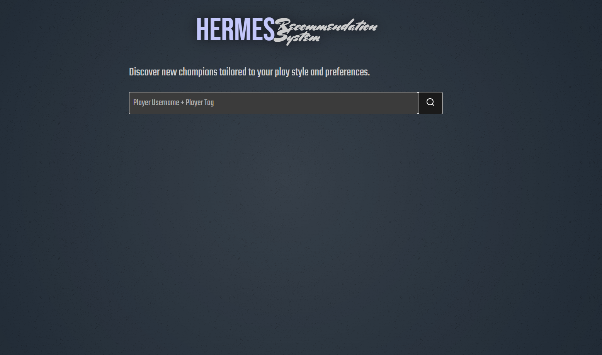

# Hermes Recommendation System

This is a personal project focused on building a recommendation system designed to help both new and experienced League of Legends players discover champions that best match their playstyle, based on their highest mastery scores.

## The Website

Currently, this project is being hosted on https://hermes.tameirao.me/.

## How to Use

On the initial page, enter the player's username and tag in the input field. The system will retrieve the player's highest mastery scores through the Riot API and recommend 20 champions, determined based on the similarity between the fetched data and the entries in the database.

